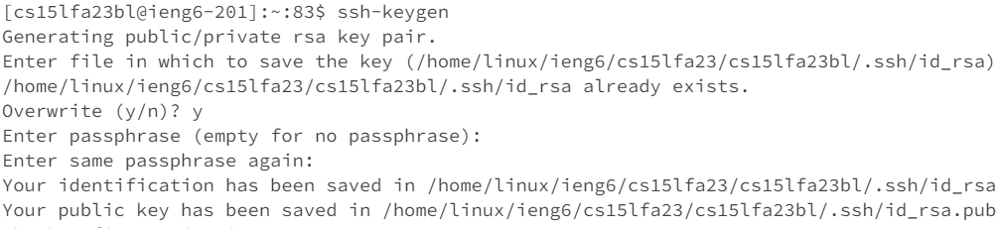
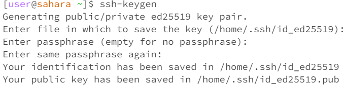

# Let us commence forth!
---
*Lab Report 1*
---
# CD

 
1. Entering cd without an argument in the command terminal when the working directory is /home does nothing. However, based on the second picture, when entering cd   without an argument while in a different directory (/lecture1), the current directory is changed to /home. From this, cd without an argument sets the current       directory to /home. The working directory is /home.
  The output implies that this is not an error, as the default directory and current directory in the
  workspace is /home, and there is no change to that.
2. Entering cd and a directory changes the working directory to /home/lecture1. The working directory
  was /home before running, and is /home/lecture1 after running. The output shows that this is not an
  error as the working directory was correctly changed.
3. Entering cd and a file returns a statement that it is not a directory. The working directory is
  /home/lecture1. The output implies that it was an error, seeing as changing directory to a file would not work.

# LS

1. Entering ls without an argument returns lecture1. The working directory is /home. The output
  shows that this is not an error because ls is showing the contents of the current directory,
  /home, which is just lecture1.
2. Entering ls with the directory lecture1 returns 4 things: Hello.class, Hello.java, messages,
  and README. The working directory is /home. The output shows that this is not an error because
  ls is showing the contents of the directory /home/lecture1.
3. Entering ls with the file en-us.txt with lecture1/messages/en-us.txt returns
  lecture1/messages/en-us.txt. The working directory is /home. The output implies that this is not
  an error because ls is showing the contents of the current directory,
  /home/lecture/messages/en-us.txt, which is itself.

# CAT

1. Entering cat without an argument does nothing, but the terminal goes on to the next line.
  Entering any text causes the terminal to return the same text, except the command CTRL-D,
  which allowed for commands again. The working directory is /home. This is unusual, but it
  does not seem to be an error even though there was no argument.

2. Entering cat with the directory messages returns the statement that messages is a directory.
  The working directory is /home. The output implies that this is an error because cat is used
  to read files, not directories.

3. Entering cat with the file en-us.txt returns the text within the .txt file, "Hello World!"
  The working directory is /home/lecture1/messages. The output shows that this is not an error,
  as cat is used to read files like en-us.txt.

*Lab Report 2*
---
# Step 1

# The Code
 
 

Screenshot 1
 

My code calls handleRequest(URI url).

The argument of handleRequest is /add-message?s=Bonjour.
The values of the relevant fields are num = 0, entry = "", and list = "" since those are 
the starting values when opening a new server.

num increases by 1 to represent the first added message. entry is set to "1. Bonjour" as 
that is the number set by num and the query after the equal sign, "Bonjour". list is set 
to "1. Bonjour" because it is the first entry of the list. There is a \n after each entry 
to make a new line for each subsequent entry.

Screenshot 2

My code calls handleRequest(URI url).

The argument of handleRequest is /add-message?s=Pain.
The values of the relevant fields are num = 1, entry = "1. Bonjour", and list = "1. Bonjour" 
since those values carried over from the previous request.

num increases by 1 to become 2 since this is the second request. entry is set to "1. Bonjour"
as that is the number set by num and the query after the equal sign, "Pain". list is set to 
"1. Bonjour \n 2. Pain" because it includes all entries up to and including this current 
entry. Again, \n denotes a new line.

# Step 2
The path to the private key for the SSH key:

The path is in /home/linux/ieng6/cs15lfa23/cs15lfa23bl/.ssh/id_rsa.

The path to the public key for the SSH key:

The path is in /home/.ssh/id_ed25519.

Logging into ieng6 with my course-specific account on the terminal:

# Step 3
In Weeks 2 and 3 I learned about the ssh command and how I could log into my CS15L UCSD account from anywhere. The most interesting part about the ssh command was how I could remove the need to type in the password every time in VSC. I'm still a little confused on how it stores folders and how I can access and change them though.
