# Let us commence forth!
---
*Lab Report 1*
---
# CD
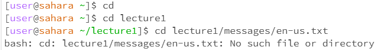
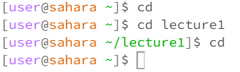 
1. Entering cd without an argument in the command terminal when the working directory is /home does nothing. However, based on the second picture, when entering cd   without an argument while in a different directory (/lecture1), the current directory is changed to /home. From this, cd without an argument sets the current       directory to /home. The working directory is /home.
  The output implies that this is not an error, as the default directory and current directory in the
  workspace is /home, and there is no change to that.
2. Entering cd and a directory changes the working directory to /home/lecture1. The working directory
  was /home before running, and is /home/lecture1 after running. The output shows that this is not an
  error as the working directory was correctly changed.
3. Entering cd and a file returns a statement that it is not a directory. The working directory is
  /home/lecture1. The output implies that it was an error, seeing as changing directory to a file would not work.

# LS
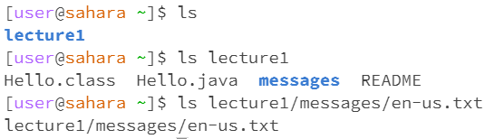

1. Entering ls without an argument returns lecture1. The working directory is /home. The output
  shows that this is not an error because ls is showing the contents of the current directory,
  /home, which is just lecture1.
2. Entering ls with the directory lecture1 returns 4 things: Hello.class, Hello.java, messages,
  and README. The working directory is /home. The output shows that this is not an error because
  ls is showing the contents of the directory /home/lecture1.
3. Entering ls with the file en-us.txt with lecture1/messages/en-us.txt returns
  lecture1/messages/en-us.txt. The working directory is /home. The output implies that this is not
  an error because ls is showing the contents of the current directory,
  /home/lecture/messages/en-us.txt, which is itself.

# CAT
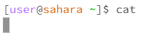

1. Entering cat without an argument does nothing, but the terminal goes on to the next line.
  Entering any text causes the terminal to return the same text, except the command CTRL-D,
  which allowed for commands again. The working directory is /home. This is unusual, but it
  does not seem to be an error even though there was no argument.

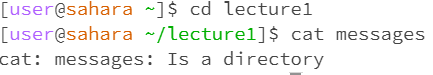

2. Entering cat with the directory messages returns the statement that messages is a directory.
  The working directory is /home. The output implies that this is an error because cat is used
  to read files, not directories.

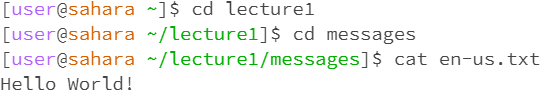

3. Entering cat with the file en-us.txt returns the text within the .txt file, "Hello World!"
  The working directory is /home/lecture1/messages. The output shows that this is not an error,
  as cat is used to read files like en-us.txt.

*Lab Report 2*
---
# Step 1

# The Code
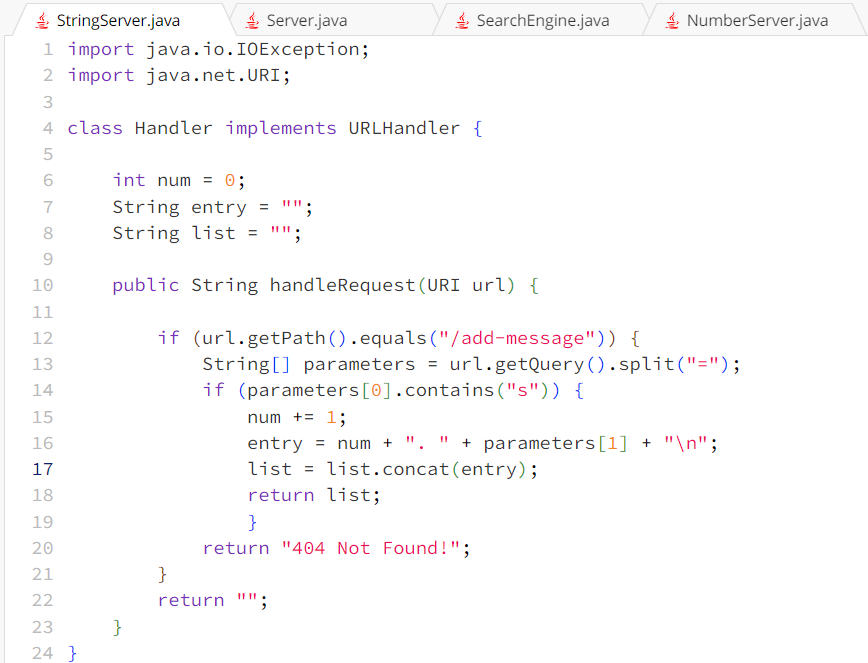 
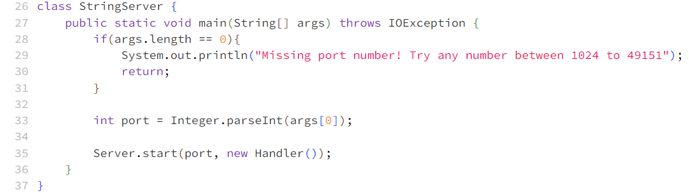 

Screenshot 1
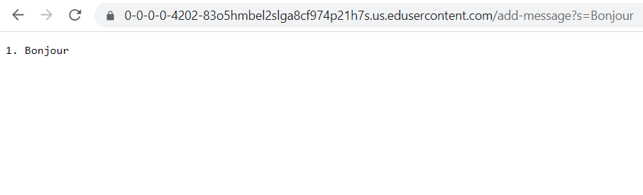 

My code calls handleRequest(URI url).

The argument of handleRequest is /add-message?s=Bonjour.
The values of the relevant fields are num = 0, entry = "", and list = "" since those are 
the starting values when opening a new server.

num increases by 1 to represent the first added message. entry is set to "1. Bonjour" as 
that is the number set by num and the query after the equal sign, "Bonjour". list is set 
to "1. Bonjour" because it is the first entry of the list. There is a \n after each entry 
to make a new line for each subsequent entry.

Screenshot 2
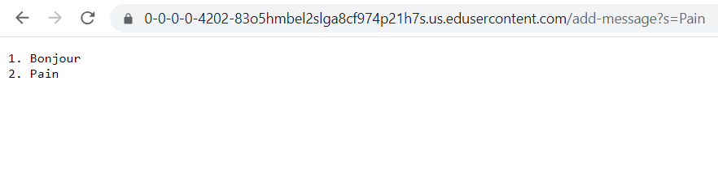

My code calls handleRequest(URI url).

The argument of handleRequest is /add-message?s=Pain.
The values of the relevant fields are num = 1, entry = "1. Bonjour", and list = "1. Bonjour" 
since those values carried over from the previous request.

num increases by 1 to become 2 since this is the second request. entry is set to "1. Bonjour"
as that is the number set by num and the query after the equal sign, "Pain". list is set to 
"1. Bonjour \n 2. Pain" because it includes all entries up to and including this current 
entry. Again, \n denotes a new line.

# Step 2
The path to the private key for the SSH key:

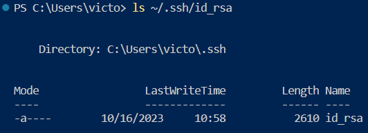

The path is in /home/.ssh/id_rsa.

The path to the public key for the SSH key:

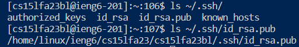

The path is in /home/linux/ieng6/cs15lfa23/cs15lfa23bl/.ssh/id_rsa.pub.

Logging into ieng6 with my course-specific account on the terminal:

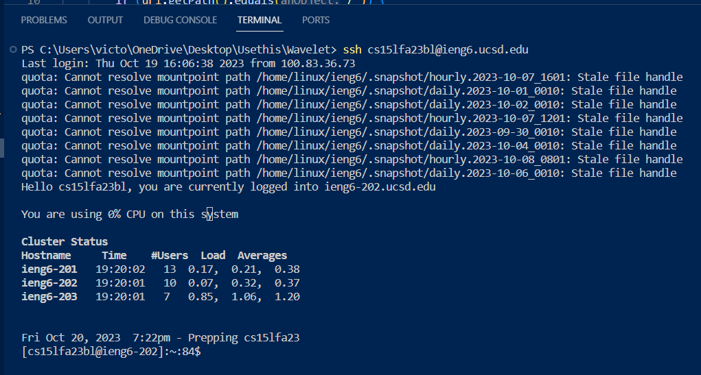

# Step 3
In Weeks 2 and 3 I learned about the ssh command and how I could log into my CS15L UCSD account from anywhere. The most interesting part about the ssh command was how I could remove the need to type in the password every time in VSC. I'm still a little confused on how it stores folders and how I can access and change them though.

*Lab Report 3*
---
# Part 1 - Bugs

The bug I chose is averageWithoutLowest() in ArrayExamples.java, which removes all instances of the lowest number when calculating the average.

# The Failure-Inducing Input

~~~
@Test
  public void testAverageWithoutLowestFail() {
    double[] test = {5,7,5};
    double result = ArrayExamples.averageWithoutLowest(test);

    assertEquals(6, result, 0.001);

  } 
~~~

# The Passing Input

~~~
@Test
  public void testAverageWithoutLowestPass() {
    // Expected is 9, actual is 9
    double[] test = {3,9,9};
    double result = ArrayExamples.averageWithoutLowest(test);
    assertEquals(9, result, 0.001);
  }
~~~

# The Symptom

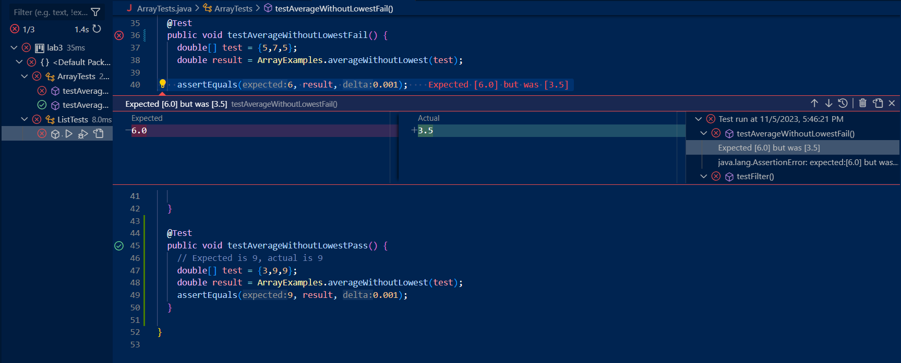 

# The Bug

*Before*
~~~
static double averageWithoutLowest(double[] arr) {
    if(arr.length < 2) { return 0.0; }
    double lowest = arr[0];
    for(double num: arr) {
      if(num < lowest) { lowest = num; }
    }
    double sum = 0;
    for(double num: arr) {
      if(num != lowest) { sum += num; }
    }
    return sum / (arr.length - 1);
  }
~~~

*After*
~~~
static double averageWithoutLowestFixed(double[] arr) {
    if(arr.length < 2) { return 0.0; }
    double lowest = arr[0];
    for(double num: arr) {
      if(num < lowest) { lowest = num; }
    }
    double sum = 0;
    int oneLowest = 0;
    for(double num: arr) {
      if(num != lowest && oneLowest == 0) { 
        sum += num; 
        oneLowest++;
      }
    }
    return sum / (arr.length - 1);
  }
~~~

This fix makes sure that only one instance of the lowest number
is not added to the sum with the inclusion of oneLowest, which
keeps track (0 means the lowest has not been passed yet, 1+ means
it has).

# Part 2 - Researching Commands
All information about grep command-line options come from this website: 
https://www.geeksforgeeks.org/grep-command-in-unixlinux/.
It provides brief explanations of what each option does and an example,
which I used to compare my results with ./technical.

*grep -i: file*
~~~
$ grep -i "ion" ./technical/biomed/rr37.txt
        Introduction
        Asthma is a common condition in general medical
        disease severity [ 2]. The hospitalization rate, another
        population-level marker of asthma severity, remains [...]
~~~
grep -i does a case sensitive search for a string in a given file, 
returning the lines in a file that contain the given string. This 
is useful for finding a specific word(s) or phrase(s) within the 
lines in a file, including ones with uppercase letters.

*grep -i: directory*
~~~
$ grep -i "ion" ./technical/biomed
grep: ./technical/biomed: Is a directory
~~~
grep -i searches for a given string in a file. It does not seem 
to work for directories, which itself does not have a string.

*grep -c: file*
~~~
$ grep -c "pathogenesis" ./technical/biomed/rr166.txt
3
~~~
grep -c returns the number of lines in a file that match the 
string given. It is case-sensitive and does not count duplicates 
if there exists more than one instance of the given string in 
the same line, just one count per line. This is useful for 
finding a specific count of how many lines contain the string, 
like if there were thousands of lines in a file or checking multiple files.

*grep -c: directory*
~~~
$ grep -c "pathogenesis" ./technical/biomed
grep: ./technical/biomed: Is a directory
0
~~~
grep -c counts the lines in a file that contains the string, 
case-sensitive. It does not work on a directory, which has 
no lines in itself.

*grep -l: file*
~~~
$ grep -l "Introduction" ./technical/biomed/rr172.txt
./technical/biomed/rr172.txt
~~~
grep -l returns the file name that has the string within it. 
This could be useful when you don't need to find the number 
of lines or the lines themselves that match, and you just 
need the file or the path that does.

*grep -l: directory*
~~~
$ grep -l "Introduction" ./technical/biomed
grep: ./technical/biomed: Is a directory
~~~
grep -l returns a file name that has the matching string, 
but it doesn't work on directories.

*grep -n: file*
~~~
$ grep -n "Synopsis" ./technical/biomed/ar120.txt
5:        Synopsis
~~~
grep -n shows the line number in a file that contains the 
string. This is useful for pinning down the locations of 
the string if you know that it exists somewhere within the 
file.

*grep -n: directory*
~~~
$ grep -n "Synopsis" ./technical/biomed
grep: ./technical/biomed: Is a directory
~~~
grep -n cannot return the line number of the string for 
directories because they are not files.

*Lab Report 4*
---
# 4. Log into ieng6
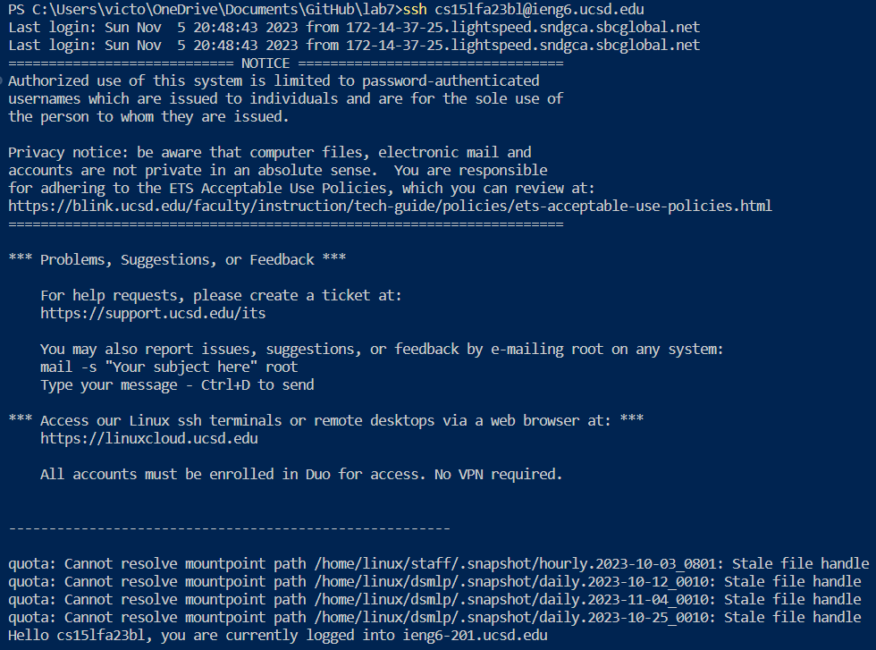
~~~
Keys pressed: <up>
To log in, the only key I needed to press was the up key, as that was the last command
I entered before reproducing this task. ssh is used to connect to my ieng6 UCSD server.
~~~
# 5. Clone your fork of the repository from your Github account
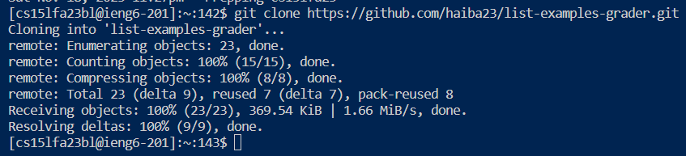 
~~~
Keys pressed: git clone https://github.com/haiba23/list-examples-grader.git
I forked list-examples-grader in the beginning of the lab, so I used the git clone
command and copied the URL from the green <> Code button to clone my fork from my
Github account into VSC.
~~~
# 6. Run the tests, demonstrating that they fail
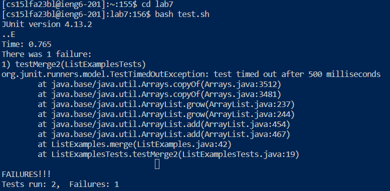 
~~~
Keys pressed: cd lab7 <Enter> bash test.sh
I had to change the directory over to lab7, where the cloned fork was in and then
I ran test.sh. I can see that it ran 2 tests and failed 1.
~~~
# 7. Edit the code file to fix the failing test
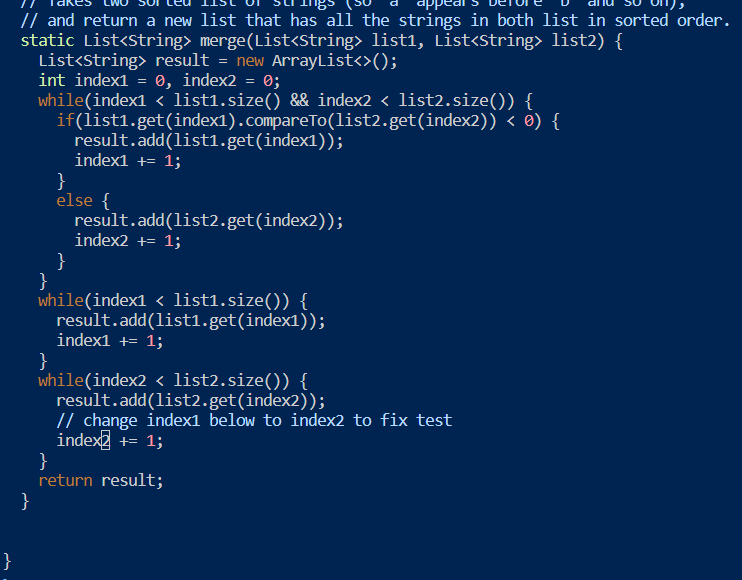 
~~~
Keys pressed: 44 <Shift + g>, e, r2, :wq!
Thanks to the help of my lab group, we discussed a much faster way to fix the code.
44 <Shift + g> moves the cursor to the beginning of line 44, right on the 'i' in 'index1'. e moves the cursor to the end of 'index1', on '1'. r2 replaces the '1' the cursor is on to '2'. Lastly, :wq! forcefully saves and exits vim.
~~~
# 8. Run the tests, demonstrating that they now succeed
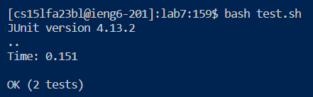 
~~~
Keys pressed: bash test.sh
I ran test.sh again and this time, the tests seemed to have passed.
~~~
# 9. Commit and push the resulting change to your Github account (you can pick any commit message!)
*Commit*
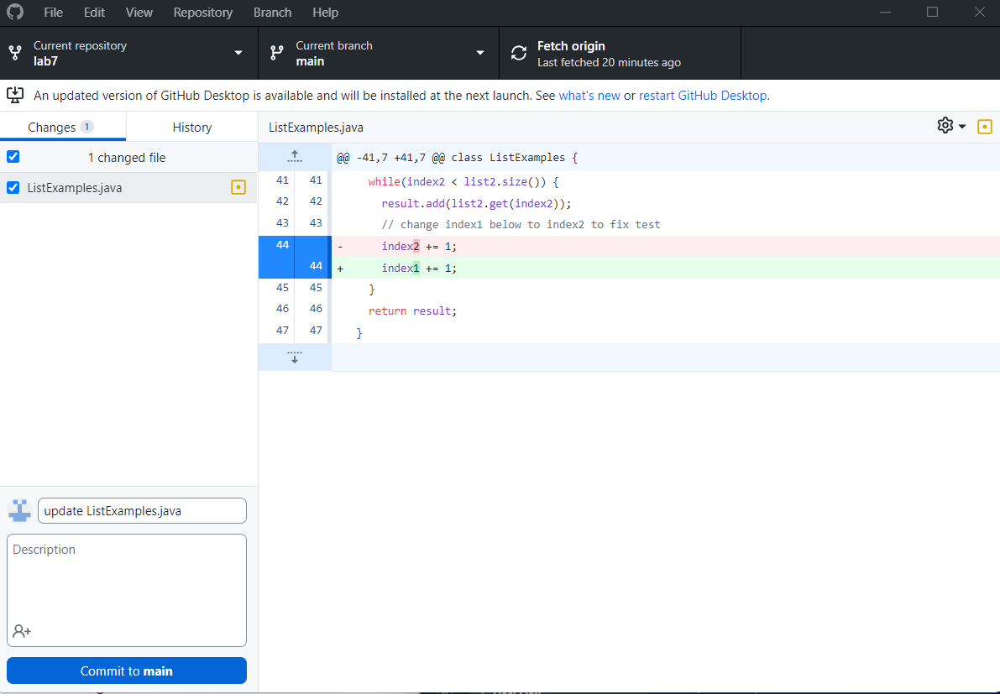 
~~~
I went on Github Desktop to commit my changes. The update message was "Update
ListExamples.java".
~~~
*Push*
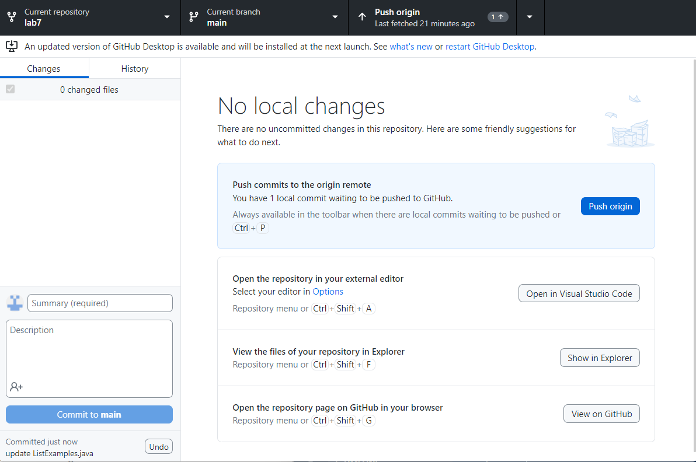 
~~~
To push the change, I clicked "Push origin".
~~~
